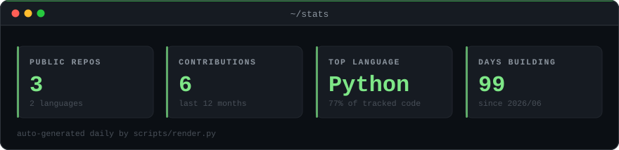
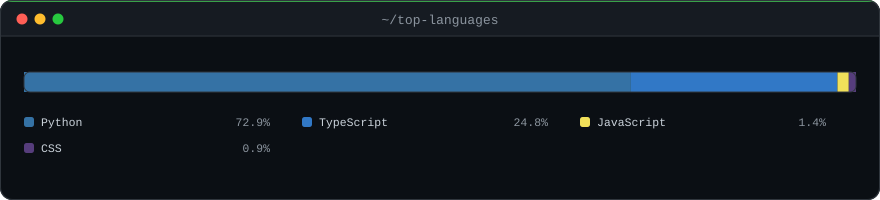

<div align="center">
  
</div>

<br>

### `$ whoami`

```console
$ whoami
nanfeng

$ cat ~/bio.txt

以前我是「让 AI 帮我写完代码」的那种人。
现在想把判断力长回自己身上 —— 模型会算，
但遇到问题该选哪个模型，这件事得我自己说了算。
```

<br>

### `$ cat ~/now.txt`

```console
$ cat ~/now.txt --format=table

  🧮  数学建模    评价 / 预测 / 优化 / 微分方程 四大底盘已通关，正在做整题模拟
  🤖  AI Agent    阶段 1 —— 不用任何框架，从原生 API + function calling 手写最小 agent
  📱  移动端      用 Expo 写了个久坐提醒 App（自定义文案 + 导入铃声 + 中文语音播报）
```

<br>

### `$ ls ~/projects`

<table>
<tr>
<td width="50%" valign="top">

**🐦 [AI-Flappy-Bird](https://github.com/nanfengjunhuai/AI-Flappy-Bird)**

用 NEAT 神经进化训练 AI 打 Flappy Bird。不是调现成模型——种群初始化、适应度评估、交叉、变异，全部手写。训练几代后适应度从 **58 涨到 20900**，鸟自己学会了不撞管子。

`Python` `NEAT` `Pygame`

</td>
<td width="50%" valign="top">

**⏰ [restreminder](https://github.com/nanfengjunhuai/restreminder)**

Expo / React Native 写的久坐提醒 App。提醒文案可以自己改，铃声可以自己导入，到点用中文语音念出来——不是那种弹个通知就完事的敷衍提醒。

`React Native` `Expo` `expo-speech`

</td>
</tr>
</table>

<br>

### `$ cat ~/stack.txt`

<div align="center">
  
</div>

<br>

### `$ tail -f ~/roadmap.log`

```console
$ tail -f ~/roadmap.log

[ Track A ]  AI Agent 开发                                    ← 今年主线
  [x]  阶段 0   建立心智模型   —— 搞清 Agent 是什么、以及什么时候根本不该用它
  [>]  阶段 1   手写最小 agent —— 原生 API + function calling 的工具调用循环，不用框架
  [ ]  阶段 2   给它加结构     —— 短记忆 → 长记忆（简单 RAG）→ 任务分解
  [ ]  阶段 3   落地业务 MVP   —— 定场景 → 缩到最小 → 做出来 → 加评估 → 加兜底

[ Track B ]  数学建模
  [x]  评价类   AHP · 熵权法 · TOPSIS · 灰色关联
  [x]  预测类   GM(1,1) · 线性回归 · BP 神经网络
  [x]  优化类   LP · ILP · NLP · 遗传算法
  [x]  微分方程 Logistic · SIR · 差分方程
  [x]  通用     蒙特卡洛 · 灵敏度分析 · 模型检验
  [>]  实战     整题模拟 —— 已通 1998A 投资组合、2007A 人口预测
```

<br>

### `$ ./stats --live`

<div align="center">
  
</div>

<div align="center">
  
</div>

<br>

---

<div align="center">
  <sub>
    数据卡片由 <code>scripts/render.py</code>
    每天从 GitHub API 拉真实数据重新生成。
  </sub>
</div>
