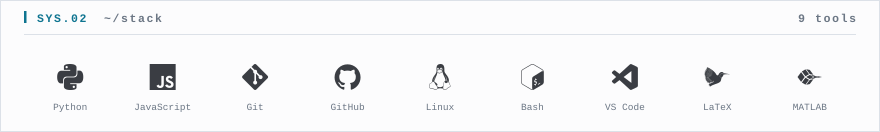
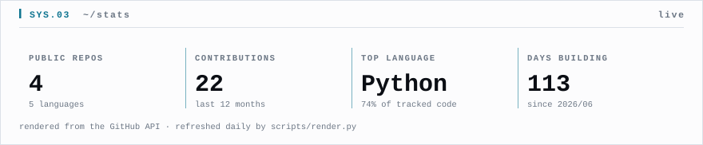
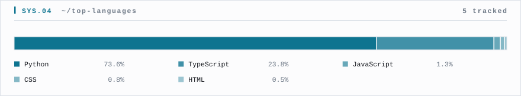

  <picture>
    <source media="(prefers-color-scheme: dark)" srcset="assets/hero-dark.svg">
    
  </picture>

 

## whoami

> 物理 / 光电背景，日常在 Jupyter 里跟 I-U 曲线打交道。
>
> 以前我是「让 AI 帮我写完代码」的那种人。现在想把判断力长回自己身上 ——
> 模型会算，但遇到问题该选哪个模型，这件事得我自己说了算。

 

## now

| | 方向 | 正在做的事 |
|:--|:--|:--|
| `01` | **数学建模** | 评价 / 预测 / 优化 / 微分方程 四大底盘已通关，正在做整题模拟 |
| `02` | **AI Agent** | 阶段 1 —— 不用任何框架，从原生 API + function calling 手写最小 agent |
| `03` | **移动端** | 用 Expo 写了个久坐提醒 App（自定义文案 + 导入铃声 + 中文语音播报） |

 

## projects

| 项目 | 做了什么 | 栈 |
|:--|:--|:--|
| **[AI-Flappy-Bird](https://github.com/nanfengjunhuai/AI-Flappy-Bird)** | 用 NEAT 神经进化训练 AI 打 Flappy Bird。不是调现成模型——种群初始化、适应度评估、交叉、变异，全部手写。训练几代后适应度从 **58 涨到 20900**，鸟自己学会了不撞管子。 | `Python` `NEAT` `Pygame` |
| **[restreminder](https://github.com/nanfengjunhuai/restreminder)** | Expo / React Native 写的久坐提醒 App。提醒文案可以自己改，铃声可以自己导入，到点用中文语音念出来——不是那种弹个通知就完事的敷衍提醒。 | `React Native` `Expo` `expo-speech` |

 

## stack

  <picture>
    <source media="(prefers-color-scheme: dark)" srcset="assets/stack-dark.svg">
    
  </picture>

 

## roadmap

**Track A · AI Agent 开发** —— 今年主线

- [x] **阶段 0 · 建立心智模型** —— 搞清 Agent 是什么、以及什么时候根本不该用它
- [ ] **阶段 1 · 手写最小 agent** —— 原生 API + function calling 的工具调用循环，不用框架 ← **进行中**
- [ ] **阶段 2 · 给它加结构** —— 短记忆 → 长记忆（简单 RAG）→ 任务分解
- [ ] **阶段 3 · 落地业务 MVP** —— 定场景 → 缩到最小 → 做出来 → 加评估 → 加兜底

**Track B · 数学建模**

- [x] **评价类** —— AHP · 熵权法 · TOPSIS · 灰色关联
- [x] **预测类** —— GM(1,1) · 线性回归 · BP 神经网络
- [x] **优化类** —— LP · ILP · NLP · 遗传算法
- [x] **微分方程** —— Logistic · SIR · 差分方程
- [x] **通用** —— 蒙特卡洛 · 灵敏度分析 · 模型检验
- [ ] **实战** —— 整题模拟，已通 1998A 投资组合、2007A 人口预测 ← **进行中**

 

## stats

  <picture>
    <source media="(prefers-color-scheme: dark)" srcset="assets/stats-dark.svg">
    
  </picture>
  <picture>
    <source media="(prefers-color-scheme: dark)" srcset="assets/langs-dark.svg">
    
  </picture>

 

---

  
    上面 hero 里的曲线不是装饰——是解出来的双二极管 I-V 模型，实测与单二极管拟合之间那道楔形
    是真实存在的双斜率现象。所有视觉资产都由 <code>scripts/</code> 下的脚本生成后提交进仓库，
    不依赖任何第三方卡片服务。
  

