# theme probe

Verification fixture — delete once the mechanism is settled.

Whether GitHub rewrites a **relative** path at page-render time differs between
`` and `<picture><source>`, and that decides whether the images load at
all on a network where `raw.githubusercontent.com` is unreliable. The markdown
API proves the sanitizer keeps both forms; it does not prove the page rewrites
them, because rewriting happens later. Only a rendered page settles it.

## A: img + fragment, relative

## B: picture + relative srcset

<picture>
  <source media="(prefers-color-scheme: dark)" srcset="assets/hero-dark.svg">
  
</picture>
